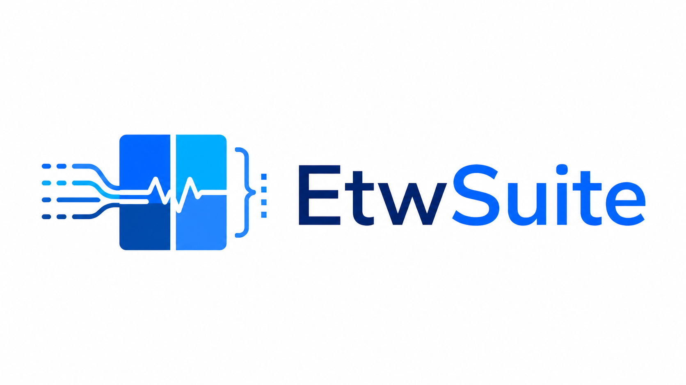

# EtwSuite




EtwSuite is an ETW inspection suite inspired by [EtwExplorer](https://github.com/zodiacon/EtwExplorer) built as a Windows App with the goal of being a one stop shop for ETW provider browsing, live event collection, recording, filtering, and offline inspection easier to work with from one local desktop tool.

## Current Features

> [!IMPORTANT]
>
> ETW metadata is often incomplete, provider specific, version dependent, or
> access restricted. EtwSuite won't be able to load all providers and will show an appropriate error when metadata is not available.

- List registered ETW providers.
- Search providers by name or GUID, including wildcard matching.
- Inspect provider GUIDs and available event schema metadata.
- Consume live ETW events from a selected provider.
- Enable providers by GUID or name with explicit level and keyword masks.
- View live events with provider, event name, ID, version, opcode, level,
  process, thread, and payload fields.
- Filter live and recorded events with basic text/wildcard search.
- Filter events with a SQL-style in-process expression parser.
- Record consumed sessions to native `.etl` files.
- Export captured event rows to JSON and CSV.
- Open supported recordings: Any `.etl`, exported `.json` and `.csv`.
- Save, load, and delete session templates in a local SQLite database.
- Open a provider directly from the provider list in the consuming window.
- Run focused tests for filtering, recording reads, and saved session storage.

## Filtering

The event filter supports two modes:

- `Basic`: case-insensitive text search with `*` and `?` wildcard support.
- `SQL`: a safe in-process expression parser. EtwSuite does not execute SQL
  against a database and does not allow function calls or arbitrary member
  access.

Example SQL filters:

```sql
event_id = 1
process_name LIKE 'powershell%'
payload.ImageName LIKE '*cmd.exe'
WHERE provider LIKE 'Microsoft-Windows-*' AND pid = 4242
```

See [docs/event-sql-filtering.md](docs/event-sql-filtering.md) for the full field list and syntax.

## Recordings

EtwSuite can currently open:

- `.etl`: native ETW trace files read with TraceEvent.
- `.json`: JSON files exported by EtwSuite.
- `.csv`: CSV files exported by EtwSuite.

`.evtx` and other file types are not supported yet. ETL payload decoding is best effort because provider metadata may not be present on the machine reading the file.

See [docs/recordings.md](docs/recordings.md) for the current recording behavior.

## Basic Usage

1. [Install](#installation) or [build](#build-from-source) EtwSuite and its dependencies.
2. Use `List Providers` to find a provider by name or GUID.
3. Open `Consume Provider`, select a provider, choose level/keyword options,
   and start consuming events.
4. Use `Record ETL` if you want a native ETW recording.
5. Use `Open Recording` to inspect `.etl`, `.json`, or `.csv` files later.
6. Use `Saved Sessions` to persist provider and filter combinations in SQLite.

## Setup

### Installation

For installation, download the latest release and install the MSI for your architecture.

### Build From Source

#### Requirements

- Windows 10 1809 or newer.
- Visual Studio 2022 or newer with .NET desktop development support.
- .NET 8 SDK.
- Windows App SDK build support.
- The listed dependencies.

#### Dependencies

- [Microsoft.Diagnostics.Tracing.TraceEvent](https://www.nuget.org/packages/Microsoft.Diagnostics.Tracing.TraceEvent)
- [Microsoft.O365.Security.Native.ETW](https://www.nuget.org/packages/Microsoft.O365.Security.Native.ETW)
- [Microsoft.Data.Sqlite](https://www.nuget.org/packages/Microsoft.Data.Sqlite)
- [Microsoft.WindowsAppSDK](https://www.nuget.org/packages/Microsoft.WindowsAppSDK)

Some live ETW providers require administrator privileges or special system permissions (e.g. Microsoft-Windows-Threat-Intelligence). Basic provider browsing, saved sessions, and supported offline recording inspection should not require elevation.

#### Build Commands

```powershell
dotnet build EtwSuite.sln
```

Release build:

```powershell
dotnet build EtwSuite.sln -c Release
```

Build MSI installers:

```powershell
dotnet build installer\EtwSuite.Installer\EtwSuite.Installer.wixproj -c Release -p:Platform=x64 -p:AcceptEula=wix7
dotnet build installer\EtwSuite.Installer\EtwSuite.Installer.wixproj -c Release -p:Platform=ARM64 -p:AcceptEula=wix7
```

Only pass `AcceptEula=wix7` after confirming the WiX Toolset OSMF terms apply
appropriately for your use.

If ICE validation fails because the build environment cannot access the Windows
Installer service, add `-p:SuppressValidation=true`.

### Test

```powershell
dotnet test EtwSuite.sln
```

## AI Usage

EtwSuite was built by myself with the help of Codex and Github Copilot. With that being said, all the functionality was validated and the AI generated code got reviewed (and modified) by me. I have appended an `AGENTS.md` file and `.agents` folder to the repo with the instructions for better project understanding.

With that being said, any low quality code PRs will be closed and ignored, and repeated low quality contributions may lead to a block.

## Resources

- [EtwExplorer](https://github.com/zodiacon/EtwExplorer)
- [krabsetw](https://github.com/microsoft/krabsetw)
- [Event Tracing for Windows](https://learn.microsoft.com/windows/win32/etw/event-tracing-portal)
- [TraceEvent](https://github.com/microsoft/perfview/tree/main/src/TraceEvent)
- [Windows App SDK](https://learn.microsoft.com/windows/apps/windows-app-sdk/)
- [WinUI](https://learn.microsoft.com/windows/apps/winui/)
